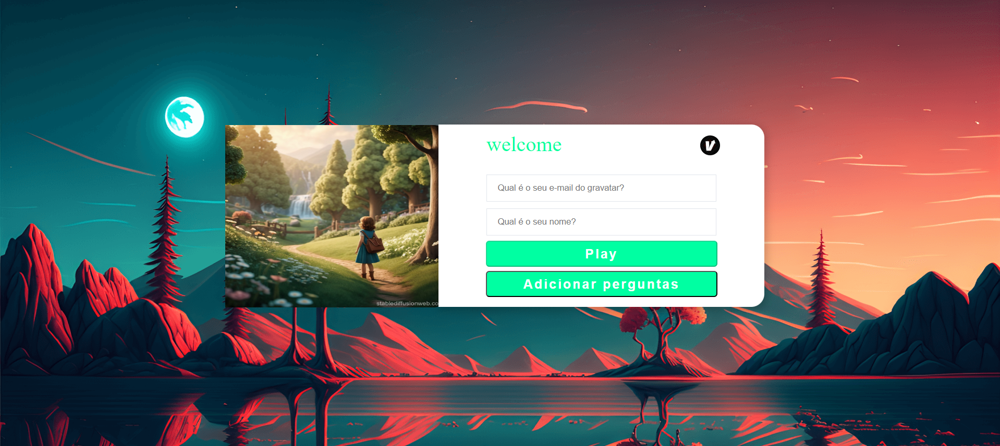

# Boas-vindas ao repositório do projeto questionario online!

Seja muito bem-vindo(a) ao repositório do Projeto questionario online Aqui você encontrará informações sobre o que foi desenvolvido neste projeto, bem como os principais aprendizados adquiridos durante o processo, para adquirir esse conhecimento, basta clicar na seta abaixo que o conteúdo se abrirá, boa leitura, espero que goste. 🙂

 

  
<strong>👨‍💻 O que eu desenvolvi</strong>
 

Este projeto é um sistema de questionário online que permite aos usuários interagirem com diferentes formulários de maneira simples e eficiente. A aplicação foi desenvolvida utilizando React no frontend e Sequelize para a comunicação com o banco de dados no backend.

Funcionalidades:
- Cadastro de Usuário: O usuário insere seu nome e e-mail antes de iniciar o questionário.
- Seleção de Formulário: O usuário pode escolher um formulário dentre os disponíveis para responder.
- Perguntas e Alternativas: Cada formulário apresenta um conjunto de perguntas, com alternativas de resposta já cadastradas.
- Sistema de Pontuação: Cada alternativa de resposta possui um peso específico. No final do questionário, o sistema contabiliza a pontuação com base nas respostas selecionadas pelo usuário.
- Este projeto tem como objetivo proporcionar uma interface amigável para a coleta e avaliação de respostas em formulários online, permitindo uma análise rápida das pontuações com base nas alternativas escolhidas.

 

  
<strong>Habilidades Adquiridas após realizar este projeto</strong>
 

Nesse projeto, eu fui capaz de:

  - Durante o desenvolvimento do Projeto Questionário Online, as seguintes tecnologias e ferramentas foram utilizadas:

Frontend:
- React: Biblioteca JavaScript para a construção de interfaces de usuário.
Backend:
- Node.js: Ambiente de execução JavaScript para o desenvolvimento do backend.
Sequelize: ORM para integração com o banco de dados MySQL.
Banco de Dados:
- MySQL: Sistema de gerenciamento de banco de dados relacional.
Testes:
- Jest: Framework de testes em JavaScript utilizado para garantir a qualidade e funcionalidade do código.
Ferramentas de Desenvolvimento:
- DBeaver: Ferramenta para gerenciar bancos de dados e realizar consultas.
- Visual Studio Code: Editor de código com suporte a várias extensões para o desenvolvimento.
- Postman: Plataforma para testar APIs e realizar chamadas HTTP.
- GitHub: Repositório para versionamento de código e colaboração.

      
<strong>Desafios Enfrentados ao realizar esse projeto</strong>
 
Durante o desenvolvimento do Projeto Questionário Online, alguns desafios se destacaram, especialmente relacionados à lógica de banco de dados e à integração entre o back-end e o front-end.

- Dificuldades no Banco de Dados:
Um dos maiores desafios foi definir e implementar a lógica no banco de dados, especialmente para lidar com a pontuação baseada nas alternativas de resposta. Trabalhar com a modelagem das tabelas e garantir que os relacionamentos estivessem corretos exigiu bastante planejamento e ajustes.

- Integração Back-End/Front-End:
Outro ponto de dificuldade foi a integração do banco de dados com o back-end e a comunicação com o front-end. Houve desafios para garantir que os dados fossem corretamente carregados e exibidos na interface, e para sincronizar as ações do usuário com o armazenamento e a manipulação dos dados no banco.

Esses desafios foram superados com bastante tentativa e erro, além de pesquisa e ajustes no código.

 

